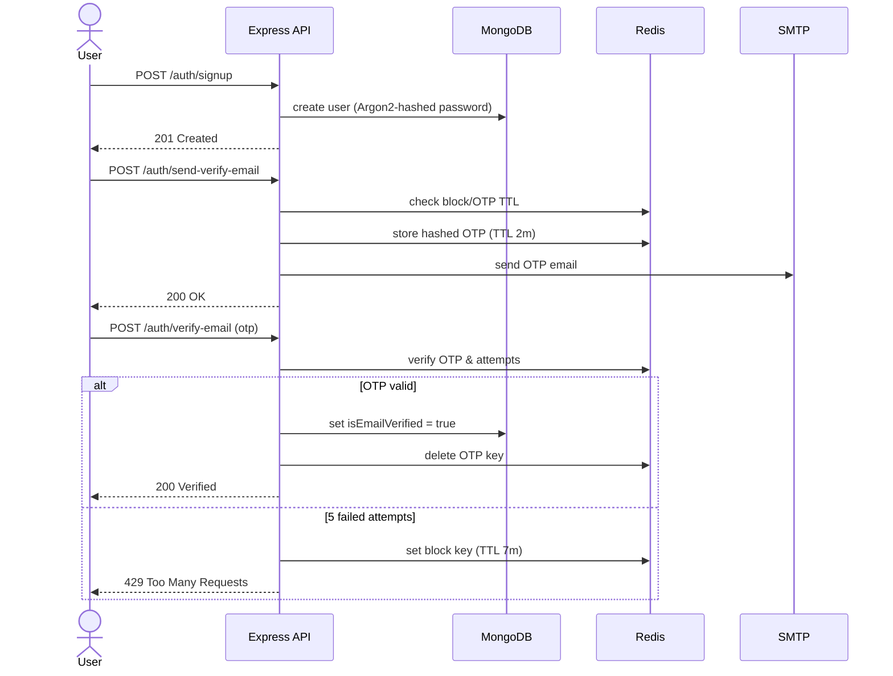
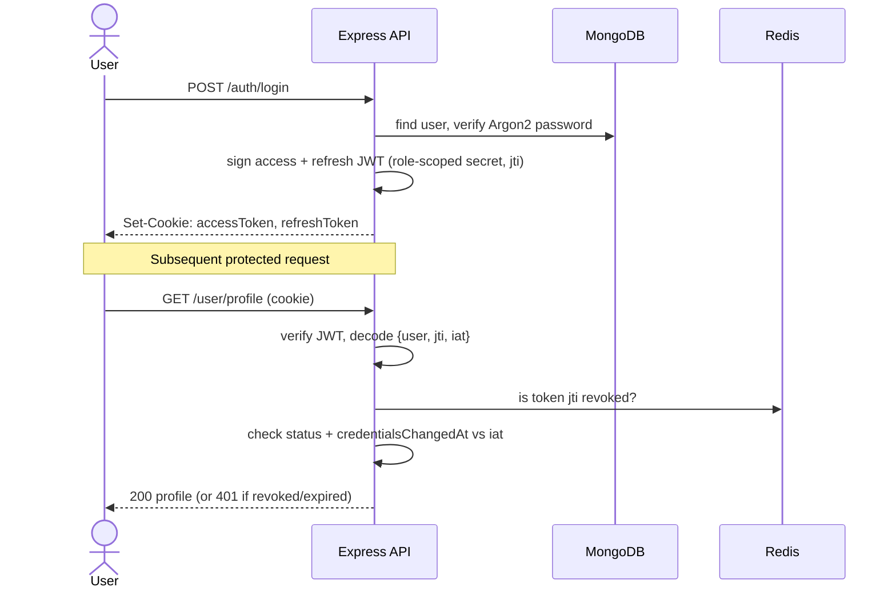

# HireHub

> A job-board platform that connects **verified companies** with **job seekers** — with admin-gated company onboarding, full job lifecycle management, and a security-first backend.

HireHub is the backend (REST API) for a hiring marketplace. Companies apply and are vetted by admins before they can post jobs; job seekers build rich profiles (experience, education, CV) and browse published openings. The codebase is written in strict TypeScript on top of Express 5, MongoDB, and Redis, with a clean layered architecture (router → controller → service → repository → model).

---

## Table of Contents

- [The Problem](#the-problem)
- [Features](#features)
- [Roadmap](#roadmap)
- [Tech Stack](#tech-stack)
- [Architecture](#architecture)
- [How the System Interacts](#how-the-system-interacts)
- [Data Models](#data-models)
- [Project Structure](#project-structure)
- [Getting Started](#getting-started)
- [Environment Variables](#environment-variables)
- [API Overview](#api-overview)
- [Security](#security)
- [Logging & Observability](#logging--observability)
- [License](#license)

---

## The Problem

Online job boards have two recurring trust and quality problems:

1. **Unverified employers.** Anyone can claim to be a company and post fraudulent or spam listings, exposing job seekers to scams. HireHub solves this with an **admin-gated company verification flow**: a user submits a company application with legal documents (commercial registration, tax card), an admin reviews it, and only on approval is a `COMPANY` account provisioned and allowed to post jobs.

2. **Weak account & data security.** Hiring platforms hold sensitive PII (CVs, phone numbers, identity documents). HireHub treats security as a first-class concern: hashed passwords, encrypted PII, role-scoped JWTs, server-side session revocation, rate limiting, OTP-protected sensitive actions, and presigned/ownership-checked file access.

The result is a platform where **employers are vetted before they reach candidates**, and **candidate data is protected end to end**.

---

## Features

Implemented in the current backend:

- **Authentication & sessions**
  - Email/password signup & login (Argon2 hashing) and **Google OAuth 2.0** (Passport).
  - Role-scoped JWTs (`USER` / `COMPANY` / `ADMIN`), delivered as HTTP-only cookies.
  - Server-side **token revocation** and "log out everywhere" via Redis + a `credentialsChangedAt` check.
  - OTP-based **email verification**, **password reset**, **email change**, and **account deletion** — all rate-limited and block-aware (Redis-backed, no DB writes until verified).
- **Role-Based Access Control (RBAC)** via a `checkRole` middleware factory.
- **Company verification workflow**
  - Users submit applications with uploaded legal documents (S3).
  - Admins approve (auto-provisions a `COMPANY` account + `Company`, emails credentials) or reject (with reason).
  - Approval runs inside a **MongoDB transaction** so a partial failure can't leave orphaned accounts.
- **Job lifecycle (company-owned)**
  - Create, partial-update, delete jobs; ownership enforced via the owning company.
  - Status transitions through dedicated endpoints: **publish** (`DRAFT → PUBLISHED`) and **close** (`PUBLISHED → CLOSED`), governed by a state machine.
  - Public reads for published jobs (all, by id, by company).
- **Job applications** — candidates apply to published jobs (CV uploaded, or snapshotted from their profile CV), with one-application-per-job enforced by a unique index; view, withdraw, and (for companies) list and status-manage applicants.
- **AI résumé scoring (Google Gemini)** — on application, the candidate's CV is parsed from PDF and scored against the job; the result (`aiRating` 0–100 + reasoning) is stored, and when the recruiter enables **`autoReject`** with an `aiThreshold`, below-threshold candidates are auto-rejected (with FCM + audit log). Runs in the background so the apply request stays fast.
- **Interviews** — companies schedule, reschedule, cancel, and complete interviews; applicants are notified via FCM.
- **Saved jobs** — candidates bookmark and list job listings (unique per user/job).
- **Reports** — candidates report companies and companies report users.
- **User profiles** — avatar, CV, experience and education entries, public/private profile views.
- **File uploads** — Multer + AWS S3, with presigned, ownership-checked download URLs (avatars, profile CVs, application CVs, and company verification documents).
- **Push notifications** — Firebase Cloud Messaging (FCM) via `firebase-admin`.
- **Transactional email** — SMTP via Nodemailer.
- **Audit logging** — business actions persisted to MongoDB (30-day TTL) alongside server logs.

---

## Roadmap

Dependencies/reserved folders exist; not yet wired up:

- **Scheduled jobs** — e.g. auto-expiring listings past their deadline (`node-cron` installed; `jobs/` reserved).
- **Frontend client** — `client/` is reserved for the web app.

---

## Tech Stack

| Concern | Technology |
|---|---|
| Language / runtime | TypeScript (strict, `nodenext` ESM), Node.js |
| Web framework | Express 5 |
| Database | MongoDB + Mongoose 9 |
| Cache / sessions / OTP | Redis |
| Auth | JSON Web Tokens, Argon2, Passport (Google OAuth 2.0) |
| Validation | Zod 4 |
| AI | Google Gemini (`@google/genai`); `pdf-parse` for CV text extraction |
| File storage | AWS S3 (`@aws-sdk/client-s3` + presigner), Multer |
| Email | Nodemailer (SMTP) |
| Push notifications | Firebase Admin (FCM) |
| Logging | Pino (+ custom MongoDB transport) |
| Security middleware | Helmet, CORS, `express-rate-limit` |
| Encryption | AES (Node `crypto`) for PII at rest |
| Dev tooling | `tsx`, `cross-env`, `concurrently` |

---

## Architecture

HireHub uses a strict **layered architecture**. Each request flows through clearly separated responsibilities, and every layer depends only on the one below it:

**Layer responsibilities**

- **Middleware** — security headers, CORS, rate limiting, JWT auth, RBAC, and Zod validation of body/params/query/files.
- **Routers** — map paths (centralized in `routes.ts`) to controllers and attach middleware.
- **Controllers** — translate HTTP ⇄ service calls; on error, delegate to a global error handler via `next(err)`.
- **Services** — business logic and orchestration across DB, Redis, S3, email, FCM, and the Gemini AI scorer.
- **Repositories** — a typed `DatabaseRepo<T>` base (`create`, `findOne`, `find`, `paginate`, `updateOne`, `deleteOne`) wrapping Mongoose.
- **Models** — Mongoose schemas, each backed by a TypeScript interface and string enums.

---

## How the System Interacts

### 1. Signup & email verification (OTP in Redis)



### 2. Login & authenticated requests (role-scoped JWT + revocation)



---

## Data Models

Exported from `server/src/models/index.ts` (always import from there):

| Model | Purpose | Status |
|---|---|---|
| `userModel` | Job seekers, company recruiters, and admins (role field) | ✅ |
| `companyApplicationModel` | Pending/approved/rejected verification submissions | ✅ |
| `companyModel` | Verified companies | ✅ |
| `jobModel` | Job listings + lifecycle status + `aiThreshold` / `autoReject` | ✅ |
| `logModel` | Activity audit log (TTL 30 days) | ✅ |
| `applicationModel` | Candidate applications to jobs (+ `aiRating` / `aiNotes` / `autoRejected`) | ✅ |
| `savedJobModel` | Bookmarked jobs | ✅ |
| `interviewModel` | Interview scheduling | ✅ |
| `reportModel` | Abuse/spam reports | ✅ |

---

## Project Structure

```
HireHub/
├── client/                 # Reserved for the frontend
├── documents/              # Project docs
├── CLAUDE.md               # In-depth architecture/dev guide
└── server/
    └── src/
        ├── server.ts       # Entry point
        ├── app.ts          # App wiring: middleware, services, routes, listen
        ├── routes.ts       # All route path strings in one place
        ├── configs/        # env + cookie config
        ├── DB/             # Mongoose + Redis services, Pino→Mongo transport
        ├── models/         # Mongoose models (+ index re-export)
        ├── middlewares/    # auth, checkRole, validate, file access, error handler
        ├── modules/        # auth · user · company · job · application · saved-job · report · interview · Gemini
        ├── events/         # notification (FCM) + email event emitters
        ├── repositories/   # DatabaseRepo<T> base + per-model repos
        ├── schemas/        # Zod validation schemas
        ├── utils/          # tokens, encryption, S3, multer, smtp, logger, ...
        ├── enums/          # string enums (no magic strings)
        └── types/          # TS interfaces for every model + DTOs
```

> For a deep dive into conventions, startup sequence, and module-by-module behavior, see [`CLAUDE.md`](./CLAUDE.md).

---

## Getting Started

### Prerequisites

- **Node.js** 20+ and npm
- **MongoDB** — must run as a **replica set** (single-node is fine) because the company-approval flow uses transactions
- **Redis** instance
- **AWS S3** bucket + IAM credentials
- **SMTP** account (for email)
- **Google OAuth** client credentials
- A **Firebase service account** JSON file at the project root (for FCM)

### Installation

```bash
git clone <repo-url>
cd HireHub/server
npm install
```

### Configuration

Create `server/.env.development` (and `server/.env.production` for prod) — see [Environment Variables](#environment-variables).

> **MongoDB transactions** require a replica set. For local dev, start MongoDB with `--replSet rs0` and run `rs.initiate()` once, or use a MongoDB Atlas connection string.

### Running

```bash
# from server/
npm run dev      # tsx watch (TS executed directly)
# or
npm run build    # tsc --watch + node --watch on compiled dist/
```

The server starts only after MongoDB, SMTP, Redis, and Passport initialize successfully; any failure logs and exits.

---

## Environment Variables

All consumed from `server/configs/env.config.ts`, selected by `NODE_ENV`.

| Group | Variables |
|---|---|
| App | `APPLICATION_NAME`, `PORT`, `CLIENT_URL` |
| Database | `MONGODB_URI` |
| Redis | `REDIS_USERNAME`, `REDIS_PASSWORD`, `REDIS_HOST`, `REDIS_PORT` |
| JWT secrets | `USER_ACCESS_SECRET`, `USER_REFRESH_SECRET`, `ADMIN_ACCESS_SECRET`, `ADMIN_REFRESH_SECRET`, `RECRUITER_ACCESS_SECRET`, `RECRUITER_REFRESH_SECRET` |
| Email (SMTP) | `SMTP_USER`, `SMTP_PASS`, `SMTP_PORT`, `SMTP_SERVICE` |
| Encryption | `ENCRYPTION_SECRET`, `ENCRYPTION_IV_LENGTH`, `ENCRYPTION_ALGORITHM` |
| Google OAuth | `GOOGLE_CLIENT_ID`, `GOOGLE_CLIENT_SECRET`, `GOOGLE_CALLBACK_URL` |
| AWS S3 | `AWS_REGION`, `AWS_ACCESSS_KEY_ID`, `AWS_SECRET_ACCESS_KEY`, `AWS_EXPIRATION`, `AWS_BUCKET_NAME` |
| AI (Gemini) | `GEMINI_API_KEY`, `GEMINI_MODEL` |

> FCM also requires a Firebase service-account JSON at the project root (git-ignored).

> Note: `AWS_ACCESSS_KEY_ID` is spelled with three S's intentionally — it matches the env var the code reads.

---

## API Overview

Base route groups (mounted in `app.ts`):

| Prefix | Module | Highlights |
|---|---|---|
| `/auth` | Authentication | signup, login, Google OAuth, verify email, refresh, forgot/reset/change password |
| `/user` | User profiles | profile, avatar, CV, experience, education, change email, delete account |
| `/company` | Companies | submit application, profile, admin approval, company jobs |
| `/job` | Jobs | public reads; company create / update / delete / **publish** / **close**; apply (`/:id/application`); list applicants |
| `/application` | Applications | my applications, single application, withdraw, company status update |
| `/save` | Saved jobs | save, unsave, list (user) |
| `/report` | Reports | report a company (user); report a user (company) |
| `/interview` | Interviews | schedule, list company interviews, update/reschedule/cancel/complete (company) |
| `/uploads/*path` | File access | auth + ownership-checked presigned S3 URLs |

A full route-by-route reference lives in [`CLAUDE.md`](./CLAUDE.md).

---

## Security

- **Passwords** hashed with Argon2; password reuse is blocked via an `oldPasswords` history.
- **PII at rest** (e.g. contact phone numbers) **AES-encrypted** via Mongoose hooks.
- **Role-scoped JWTs** with separate secrets per role, stored as HTTP-only cookies.
- **Session revocation** in Redis (per-token `jti`) plus a `credentialsChangedAt` invalidation for "log out everywhere".
- **Rate limiting** — global, auth, and AI-specific limiters.
- **OTP-gated** sensitive actions (verification, password reset, email change, account deletion) with attempt counting and temporary blocks.
- **Helmet** + scoped **CORS** (credentials, single origin).
- **File access** is authenticated and ownership-checked, returning short-lived presigned URLs rather than public links.

---

## Logging & Observability

Two Pino loggers, used deliberately:

- `activityLogger` — user/admin business actions → **MongoDB** (`Log` model, 30-day TTL) + file/console in dev.
- `serverLogger` — server/DB errors and crashes → file/console in dev, errors-only in prod.

The MongoDB transport runs on the main thread (needs Mongoose); other transports run in a Pino worker thread to stay non-blocking.

---

## License

ISC © omarhashad
